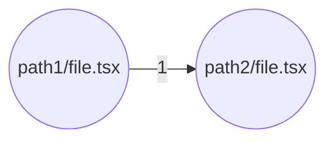
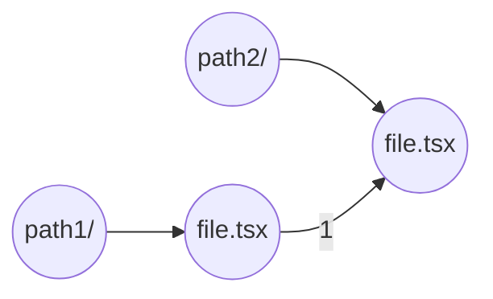
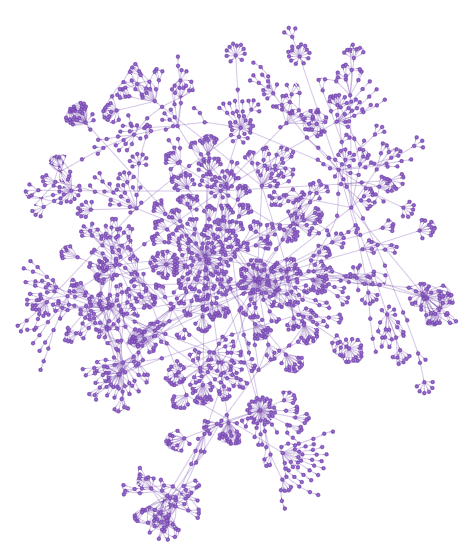
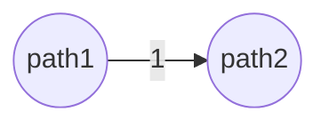

Lukas Vinther Offenberg
[luka@itu.dk](mailto:luka@itu.dk)

1. Introduction
2. Methodology
3. Results
4. Discussion
5. References
6. Appendix

## 1. Introduction

This report will perform an architectural reconstruction of the Supabase database, which is branded as a "the open source Firebase alternative" (_Supabase | the Open Source Firebase Alternative_, 2024).

The project works from the assumption that the Supabase organization has requested an architectural reconstruction of the main Supabase GitHub repository. After an imaginary talk with the Supabase organization, the problem could be summarized as a 2 point list.

- The maintenance cost of the main Supabase repository (Supabase, 2024) is rising.
- It is difficult to on-board new TypeScript developers to the main Supabase repository.

Which is simple, terms can be expressed as.

> How can we make the documentation or the architecture of the main Supabase GitHub repository more maintainable and readable/understandable? With a focus on the TypeScript code

### 1.1 Glossary

To avoid any misunderstandings, the following glossary was created for this report.

- While the project contains both JavaScript and TypeScript code, there’s a significant overweight of TypeScript code. For this reason, the code is referenced as TypeScript code, Node.js projects, etc. This also includes any JavaScript code, JavaScript projects, etc., in the repository.
- Supabase can reference many things like the Supabase company, the Supabase database solution, etc., and each Supabase entity will be referenced by name.

## 2. Methodology

A mix of off-the-shelf and custom-made tools was used to perform the architectural. Everything used and created for the reconstruction can be located in the GitHub repository linked in the [[#6.1 Custom Visualization Tool]] section of the appendix.

### 2.2 Off-The-Shelf Tools

The creation of the deployment diagram was done solely using the docker-compose-diagram tool (Skonik, 2023).

The module views were created using a combination of off-the-shelves- and custom tools. The data of the dependency graph was created using skott (Antoine-Coulon, 2024), which is a NPM package that TypeScript files in a folder and/or subfolders to generate a dependency graph. Skott has a built-in visualization, but it has no filtering functionality, which makes it unusable for larger projects. To solve this shortcoming the Python pyvis (_Tutorial — Pyvis 0.1.3.1 Documentation_, 2023) package was chosen for creating the module view.

### 2.3 Custom Made Tool

A custom Python script was developed to convert the skott dependency data into a pyvis graph. The data returned from skott lists each file and its connection to other files as a relative path, like Figure 1 below.

```json
{
  "path1/file.tsx": {
    "id": "path1/file.tsx",
    "adjacentTo": [
	    "path2/file.tsx"
    ],
    ...
  },
  ...
}
```
<p style='text-align:center;'>
Figure 1: Example snippet of how data generated using the skott tool could look like
</p>

Which can be illustrated in a graph like Figure 2.


<p style='text-align:center;'>
Figure 2: Simple graph showing how two data points could be visualized
</p>

This section will not cover in detail how the tool was implemented, but will rather cover the most essential features, please, refer to [[#6.1 Custom Visualization Tool]] for implementation details.

#### 2.3.1 Keep Folder Structure

As can be seen in Figure 1, the relative path to a node is display in the node id. Since TypeScript projects respect the file structure of the source files, an option was added to respect the folder structure in the resulting graph. This alters the graph shown in Figure 2 to the one shown in Figure 3.  Here, the weight is keep on the file edges, while edges between folders get an invisible weight of 0.


<p style='text-align:center;'>
Figure 3: Simple graph showing how showing the folder structure of files as nodes
</p>

By altering the graph to keep the folder structure, the different folders of the project clumps together as seen in the Figure 4 below which, for some, gives a better overview.

| ![[apps-studio-all-no-folder-structure.png]] |  |
| -------------------------------------------- | ---------------------------------------------------- |
```python
construct_network_graph(
	data['nodes'], 
	data['links'], 
	-1, 
	starts_with=['apps/studio/'], 
	color_mode=ColorMode.SOURCE_PACKAGE, 
	code_churn_data=code_churn_data, 
	test_coverage_data=test_coverage_data
	keep_folder_structure=True or False
)
```
<p style='text-align:center;'>
Figure 4: Two module view generated using the custom tool. On the left is a module view is generated by setting keep_folder_structure=False, while on the left keep_folder_structure=True
</p>
 
#### 2.3.2 Depth

Including all nodes and edges in as large projects as Supabase becomes cluttered and difficult to read. Hence, it was decided to add a depth filter, that would aggregate the edge references and change Figure 3 to look like Figure 5.


<p style='text-align:center;'>
Figure 5: Simple graph showing how lowering the depth handles references between files that are not included in the depth level
</p>
#### 2.3.3 Metrics

When hovering over a node both the amount of times a file has been included in a commit called `code churn`, and its test coverage of the unit tests of the Supabase repository. See Figure 6. 

![[metrics.png]]
<p style='text-align:center;'>
Figure 6: Snippet from the module view showing metrics associated with a node
</p>
#### 2.3.4 Other filters

Other filtering options are the standard pyvis options, as seen in Figure 7. Lastly, the starts with filter options is heavily used to filter out any paths that are not interested in the module view, and is heavily used in the [[#3. Results]] section.

![[pyvis-standard-filtering-options.png]]
<p style='text-align:center;'>
Figure 7: Snippet from the module view showing the default pyvis filtering options
</p>

### 2.4 Source Viewpoints

Given the focus on maintainability of the TypeScript code, both the TypeScript source code and the available documentation are chosen as data sources to crafting the source viewpoints. Since knowing what is running also helps maintain and developer, the docker-compose file was also added as a data source. 

### 2.5 Reverse Engineering Patterns

The reconstruction focused on static analysis of the TypeScript source code and docker-compose file. The metrics of code churn and test coverage was added to the nodes, as these could be relevant for developers.

### 2.6 Knowledge Inference

As mentioned in the [[#2.3.1 Keep Folder Structure]] section, TypeScript projects are often built around the folder structure, like isolating components in its own folder away from the processing logic, which means that the folder structure has some architectural significance.

The two main viewpoints of the reconstruction were the module viewpoint, as this would help gain a greater insight into the TypeScript code, and the deployment view, as understanding what is running helps when debugging issues during development.

## 3. Results

Note, this analysis was done on commit `329a2d8539f5fad6db714b112886eb4c0f9cdb3f` of the Supabase (2024) repository.

The developer documentation (see `DEVELOPERS.md` file in (Supabase, 2024)) of the Supabase repository mentions starting a set of docker container, but never mentions which containers are run. Since understanding exactly what is executing is essential for development and maintenance, this section will start by looking into the deployment view followed by the module view.

### 3.1 Deployment Viewpoint

While a docker-compose file is in a human-readable language, having some visual aid while reading the file can help. For this reason, a deployment diagram was created using the **docker-compose-diagram** tool as specified in section [[#2. Methodology]].

![[docker-compose.png]]
```bash
compose-diagram --file docker/docker-compose.yml
```
<p style='text-align:center;'>
Figure 8: Deployment view generated using the docker/docker-compose.yml file from the Supabase GitHub repository (Supabase, 2024). Generated using the docker-compose-diagram tool using the attached bash command
</p>

From the above deployment view, the analytics or db are referenced by all other entities, hence they have to be handled with care. Further, to understand which entities are relevant to the Supabase project, the docker-compose file itself has to be correlated with GitHub packages. Consider the snippet of the docker-compose file below. Looking up the docker [image on docker hub](https://hub.docker.com/r/supabase/auth) does not provide any useful information, but looking at the [packages of the Supabase GitHub Organization](https://github.com/orgs/supabase/packages?q=edge&tab=packages&q=), we see the same images - not updated for a couple of years - with a corresponding repository.

![[supabase-github-packages.png]]
```jsx
name: supabase
version: "3.8"

services:
	...
	
  auth:
    container_name: supabase-auth
    image: supabase/gotrue:v2.151.0
    ...
```
<p style='text-align:center;'>
Figure 9: Example of correlating an entity in the docker-compose file with a GitHub package
</p>

By correlating the packages and repositories, as shown in Figure 9, the only image relevant for the Supabase repository is the studio image, all other images are, for now, assumed to be stored in the other repositories.

### 3.2 Module View

Note, that the tool for generating the module views are best suited for used by a developer, during development, because they can interact with the module view to try and understand the code.

When that is said, to give an idea of how the tool can be used, this section will cover two examples. First, it will look into the separation of the various TypeScript projects, followed by a bug fix case.

After an initial analysis of the root folders of the Supabase project, a filter was applied to limit the module view to relevant TypeScript projects using the following code.

![[module-view-overview.png]]
```python
construct_network_graph(data['nodes'], data['links'], 2, starts_with=['supabase', 'apps', 'packages'], color_mode=ColorMode.SOURCE_PACKAGE)
```
<p style='text-align:center;'>
Figure 10: A module view of dependencies across the various projects, generated by the attached code snippet
</p>

We would have expected that there were no references between any of the folders at depth 2, given that the repository is a monolith repository as stated in the developer documentation (see `DEVELOPERS.md` file in (Supabase, 2024)), and due to e.g. `apps/studio/` importing the `packages/` modules as dependencies in the project configuration. Despite this there are import statements between e.g. the `apps/database-new/` and `packages/ai-commands/`, `packages/ui-patterns` and `packages/ui/` folders. This illustrates some technical debt that have not been resolved yet.

Finally, a short demonstration of how the module view could be to gain a greater insight into the `apps/studio` project. The developer has been tasked with resolving a bug in the `apps/studio/lib/helpers.ts` file, hence an initial view of the `apps/studio/` folder with a visual filter on the `lib/` folder is generated, see Figure TODO.

![[module-view-work-flow-1.png]]
```python
construct_network_graph(
	data['nodes'], 
	data['links'], 
	3, 
	starts_with=['apps/studio/'], 
	color_mode=ColorMode.SOURCE_PACKAGE, 
	code_churn_data=code_churn_data, 
	test_coverage_data=test_coverage_data
)
```
<p style='text-align:center;'>
Figure 11: Module view filtered to only show the apps/studio package and a relative narrow depth. Generated using the attached code
</p>

From Figure 11 it can be observed that only the `test/` folders has any association to the lib folder, hence another filter is applied in Figure 12. 

![[module-view-work-flow-2.png]]
```python
construct_network_graph(
	data['nodes'], 
	data['links'], 
	-1, 
	starts_with=['apps/studio/lib/'], 
	color_mode=ColorMode.SOURCE_PACKAGE, 
	code_churn_data=code_churn_data, 
	test_coverage_data=test_coverage_data
)
```
<p style='text-align:center;'>
Figure 12: Module view filtered to only show the contents of the apps/studio/lib/ folder, with a focus on the apps/studio/lib/helpers.ts file. Generated using the attached code
</p>

Besides looking at the files that could be impacted by changes to `helpers.ts`, the developer can also hover over the `helpers.ts` file to see that the file have been change quite a bit and has some tests associated with it. This could indicate that the `helpers.ts` file can be problematic, and the developer could consider expanding its test coverage to catch any future errors.

## 4. Discussion

### 4.1 Strong Points (What worked)

A strong point of this architectural recovery is the interactive module view, that the developer gets access to. Whenever work has to be done on unfamiliar code, a lot of time is spent navigating the file system, following references and manually stepping through the code in debug mode. By having a dependency graph next to the code in the form of a module view, allows the developer to filter for two specific sub folders, and see exactly how they reference each other. These filtering capabilities are also another strong point of the recovery, as it allows for generating abstract views using a low depth level, while also going in depth as mention with the filtering options. This makes the architectural decisions made more clear and the interactivity, moving- and removing nodes, is a more visual way of interacting with code.

### 4.2 Weak Points (what would you do it better next time?)

The current approach for architectural reconstruction relies heavily on static analysis, which is not in any way bad, but a combination of dynamic- and static analysis would be preferable. Dynamic analysis compensates for many of the drawbacks of static analysis, such as, we can’t detect dead code, we don’t know anything about performance, etc.

While the time constraint played a role in the focus of static analysis, another problem encountered was with the Symphony method itself (Van Deursen et al., 2004). Initially, the problem was not defined clearly, which led to the initial work being done without a clear guideline. This lack of guidance made the initial work difficult as it was hard to answer questions like “what should I look into?” and "Is this relevant?". Once the problem was clearly defined, answering these questions was easier but also lead to some work having been wasted.

### 4.3 Limitations (What are the limitations of your approach)

%% TODO: Metrics Problem %%
The metrics provided should give a developer some more insight into the architecture, and potential areas of concerns, but they also come with their own problems. 

Consider the code churn metric, that current is measured as "how often has this file been included in a commit?". While initially this seems like an okay way of measuring code churn, it does start to fall apart quick quickly. Consider if merge a feature into the main branch is done using squish commits, then all the commits of the feature branch are squished into a single commit, hence the file has now only been changed once according to the calculation of code churn. 

A solution could be to use lines changed instead, but this measurement has its own set of problems like, what if a commit changed all line endings in a file from `\n` to `\r\n`, or a lot of code is deleted because it was never used? This would then again not be a true measure of code churn, and the perfect solution was not identified in this recovery.

Many of the same arguments can also be made for test coverage, hence why every metric provided was included in the popover.

Another limitation of the recovery was skott. Skott is meant for analyzing a single repository and not a monolith repository like the Supabase repository, which in turn means that it cannot capture every reference, take the `apps/studio/package.json` that references the `packages/ui/` module in its `package.json` file. This reference is not shown in the data generated from skott and is therefore hidden in the final graph.

This is a good candidate for future work of this recovery, as the inclusion of module references in the module view would greatly enhance the architectural information contained in it. Some other good candidates for future work are, finalize the metrics, try doing creating polymetric view using the metrics, dynamic analysis, ports on deployment view, automate manual parts of the recover, etc.

## 5. References

- Antoine-Coulon. (2024). _GitHub - antoine-coulon/skott: All-in-one devtool to automatically analyze, search and visualize dependencies from JavaScript, TypeScript (JSX/TSX) and Node.js (ES6, CommonJS)_. GitHub. [https://github.com/antoine-coulon/skott](https://github.com/antoine-coulon/skott).
- Skonik. (2023). _GitHub - skonik/docker-compose-diagram: 🐳docker-compose + 🎨diagrams = docker-compose-diagram 🐳🎨_. GitHub. [https://github.com/skonik/docker-compose-diagram](https://github.com/skonik/docker-compose-diagram).
- Supabase. (2024). _GitHub - supabase/supabase: The open source Firebase alternative._ GitHub. https://github.com/supabase/supabase
- _Supabase | the open source Firebase alternative_. (n.d.). Supabase. Retrieved May 30, 2024, from [https://supabase.com/](https://supabase.com/).
- _Tutorial — pyvis 0.1.3.1 documentation_. (2023). [https://pyvis.readthedocs.io/en/latest/tutorial.html#filtering-and-highlighting-the-nodes](https://pyvis.readthedocs.io/en/latest/tutorial.html#filtering-and-highlighting-the-nodes).
- Van Deursen, A., Hofmeister, C., Koschke, R., Moonen, L., & Riva, C. (2004). Symphony: view-driven software architecture reconstruction. _Proceedings. Fourth Working IEEE/IFIP Conference on Software Architecture (WICSA 2004)_. https://doi.org/10.1109/wicsa.2004.1310696

## 6. Appendix

### 6.1 Custom Visualization Tool

Please see this GitHub Repository: [https://github.com/the-lvol/software-architecture](https://github.com/the-lvol/software-architecture)