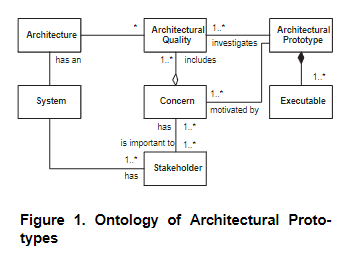
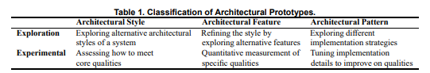

# Architectural Prototyping
    An architectural prototype consists of a set of executables created to investigate architectural qualities related to concerns raised by stakeholders of a system under development. Architectural prototyping is the process of designing, building, and evaluating architectural prototypes.

Explanation of the figure below: Figure 1 relates this definition to the software architecture ontology defined by IEEE [23]. The System is the entity being built, which may encompass, e.g., single applications, frameworks, and product lines. Stakeholders have interests in the System expressed through several Concerns regarding the development of the system. Architectural Qualities are specific Concerns of interest in architectural prototypes and include qualities such as performance, reliability, or modifiability. The Concerns and their included Architectural Qualities define the reasons for building Architectural Prototypes through a set of Executables

- Software architecture design is akin to exploring unknown territories, like Mars exploration.
- Architectural prototypes are metaphorically "being there" for architects, enabling low-cost, executable system exploration.

## Characteristics
TODO: do the following match the numbering? (Learning, Quality, No functionality (we still need some, take it with a grain of salt), Risks, Knowledge)

1. Focus on exploration and learning of architectural design.
  - Can be used to break an architect's habit of using "what has worked before" by testing something they haven't used before
2. Addresses architectural quality attributes in the target system. (see [[Quality Attribute QA]])
  - Can answer questions like "Can we guarantee high availability", "Is it cost efficient" and more
3. Does not provide functionality but facilitates it.
  - Show how to system will work, but can't be the system
4. Addresses architectural risks and knowledge transfer.
  - Can e.g. test technology platforms, programming models, and more
5. Architectural prototypes address the problem of **knowledge transfer and architectural conformance**
  - Helps with the "Is it build as designed" problem by being a reference program for the development team

## Case Studies
Reading the 3 case studies is better than reading notes on them

1. **Closed-loop Process Control**: Explored real-time performance and maintainability through pipeline and repository styles.
2. **Dragon Project**: Examined buildability, modifiability, usability, and integrability in a customer service system.
3. **Activity-Based Computing Framework**: Investigated client-server, event-based, and peer-to-peer architectures for pervasive computing support.

## Classification of Architectural Prototypes

![[Exploratory Prototypes]]

![[Experimental Prototyping]]

## Development Process
- Prototypes play roles at different development stages, from inception to transition.
- Help in understanding what to build (inception), how to build (elaboration), and refining the build through construction and transition phases.

### Example with [[Rational Unified Process RUP (4+1)]]
- **Inception**: Focuses on understanding what to build. Architectural prototypes here address major risks and essential qualities. Examples include the Closed-loop Process Control and Dragon cases, emphasizing risk management and quality assessment.
- **Elaboration**: Aims at understanding how to build the identified system components from inception. It involves defining executable architectural prototypes, nearly complete use cases, and development plans to eliminate major risks. This phase benefits from experimental architectural prototypes for risk reduction and architectural foundation setting.
- **Construction**: Concerned with incrementally building a functionally complete system, often a beta version. Architectural prototypes are used to explore detailed architectural concerns and experiment with new requirements, ensuring that the architecture supports the system's growing complexity.
- **Transition**: Involves building the final product version to be shipped to customers. While architectural prototypes might seem less relevant, the iterative nature of UP means additional phases of inception, elaboration, and construction where prototyping is beneficial. For example, the ABC framework's development involved multiple transition phases, driving the need for continuous architectural prototyping to manage evolutionary changes.

- **Integration of Architectural Prototyping in UP**:
  - Architectural prototypes can influence both the core process and supporting workflows of UP, especially when significant architectural decisions are needed.
  - In the **requirements workflow**, exploratory prototypes help uncover architectural requirements, extending the architect's vocabulary and preventing tunnel vision regarding favored architectural styles.
  - During **analysis and design**, prototypes complement architectural models by grounding choices and investigating specific architectural qualities, guided by methodologies like SAAM or ATAM.
  - An **architectural prototype** in RUP terms acts as a foundation for implementation, potentially derived from exploratory and experimental prototypes. It forms a basis for realizing functionality and further validating the architectural choices through full subsystem development.
  - Supporting workflows such as test, deployment, configuration and change management, project management, and environment can also benefit from prototypes to address specific architectural quality attributes like testability and buildability.

## Conclusion
- Architectural prototypes are crucial for exploring and defining software architecture.
- They provide a cost-effective method to demonstrate and analyze architectural choices and trade-offs.
