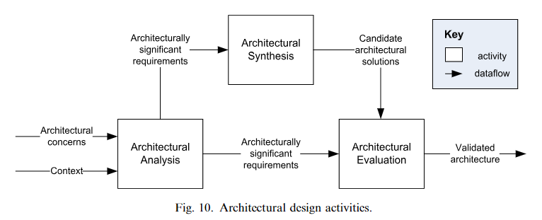

# A General Model Of Architecture Design
This model outlines the activities and artifacts involved in software architecture design, emphasizing the iterative and multi-level nature of the design process. It aims to provide a framework general enough to encompass various architecture design methods and is influenced by Gero’s Function–Behavior–Structure framework.

Note, that the process is not linear, each step is done as needed (see image below)

## Architectural Design Artifacts (And Activities)

### Architectural Concerns
Definition: Interests important to stakeholders as per IEEE 1471, encompassing system considerations like performance, reliability, security, distribution, and evolvability.

Examples: Regulatory requirements, mandated design decisions (e.g., adherence to existing standards), and system considerations such as scalability and maintainability.

### Context
Definition: The system’s environment, as determined by IEEE 1471, influences the system through developmental, operational, political, and technological aspects.

Implications: Includes organizational goals (e.g., market expansion), development capabilities (e.g., team expertise, available tools), and technological landscape (e.g., emerging tech trends).

### [[Architecturally Significant Requirements (ASRs)]]
Definition: Requirements that have a direct impact on the architecture, distinguishing between general system requirements and those that shape architectural decisions.

Identification: Through analysis of architectural concerns and context, filtering out ASRs that dictate architecture structure, behavior, and key quality attributes.

### Architectural Analysis
Purpose: To articulate the problems the architecture must address by refining architectural concerns and context into a coherent set of ASRs.

Process: Involves examining, filtering, and reformulating concerns and context, ensuring a focused set of architectural challenges to address.

### Candidate Architectural Solutions
Nature: These are design proposals that may offer alternative structures or partial solutions, encompassing a broad spectrum of design decisions from high-level architectural styles to specific component interfaces.

Content: Includes detailed design rationale, capturing the reasoning behind decisions, alternatives considered, and how solutions trace back to ASRs.

### Architectural Synthesis
Activity: The creative process of proposing architecture solutions to meet the identified ASRs, marking the transition from identifying problems to conceptualizing solutions.

Outcome: A set of coherent design proposals that address the core architectural requirements, informed by both the analysis phase and the broader design context.

### Validated Architecture
Definition: The subset of candidate architectural solutions that have been confirmed to align with ASRs and are internally consistent.

Validation Process: Through rigorous evaluation against ASRs, ensuring that the architecture is feasible, meets stakeholder goals, and the solutions are compatible.

### Architectural Evaluation
Goal: To verify that the architectural decisions made are the correct ones, ensuring that candidate solutions adequately address the ASRs.

Method: Involves a critical examination of solutions against ASRs, iterative refinement, and selection, culminating in the endorsement of a validated architecture.

## Inputs to the Design Process
- Design Knowledge
  - From architects, organizational memory, or the architecture community, including styles, patterns, and reference architectures.
- Analysis Knowledge
  - Needed to define problems and evaluate solutions, including analysis patterns and evaluation process knowledge.
- Realization Knowledge
  - Critical for evaluating and ensuring the system can be built, may require partial implementation for experimentation.

## Workflow Characterization
The model's workflow is characterized by its iterative and granular approach, with no predictable sequence until the architecture is complete and validated. This approach allows for flexibility and adaptability in addressing complex design challenges.
