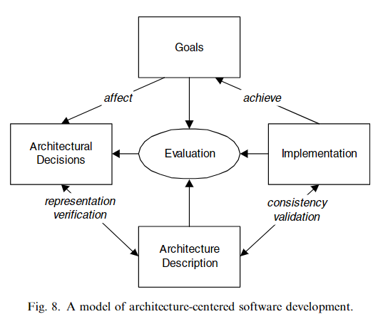

# Architectural Separation Of Concerns ASC
- Developed by Nokia, ASC/ARES is a conceptual framework employing the separation of concerns to simplify architecture design complexity.
- Focuses on ensuring architectural decisions are influenced by development goals, documented through architecture descriptions, and verified for consistency with implementation.

## Key Components

### Development and Stakeholder Goals
- Goals are analyzed to identify architecturally significant requirements (ASR) that influence software architecture.ASRs detail the measurement of goal achievement and its constraints on architecture.

### Software Transformation Cycle
- Encompasses design/development (source code), build (object files/library archives), upgrade (executable files), start-up (system state/executable entities), and operation (threads/objects) segments.
- Requirements are grouped by cycle segment (see previous bullet) for independent satisfaction, while intra-group requirements may interact or conflict, necessitating trade-offs.

### Separation of Architectural Concerns
- Architectural concerns are separated based on the software transformation cycle segments to address them independently or through trade-offs for related segment concerns.

### Design of Texture
- ASC places importance on the design decisions within fine-grained components that, despite their scale, have significant impact and cost implications if revised.
- These decisions form a recurring uniform microstructure or texture across the architecture.

## ASC Process
- Architects analyze design inputs (technology platforms, roadmaps, functional/quality requirements) to produce and prioritize ASRs.
- Implementation (Write-Time) Design:
  - Addresses ASRs related to write-time, making decisions on technology, functional requirement partitioning, portability layers, subsystem allocations, and API descriptions.
- Performance (Run-Time) Design:
  - Focuses on run-time ASRs, developing performance models, task/process partitions, scheduling policies, and resource allocation.
- Delivery/Installation/Upgrade Design:
  - Deals with ASRs for delivery, installation, and upgrade segments, covering loadable/executable unit partitions, installation support, and upgrade policies.

## Importance
ASC/ARES enhances architecture design by systematically addressing requirements across the software lifecycle, enabling targeted and effective architectural decisions and trade-offs.
