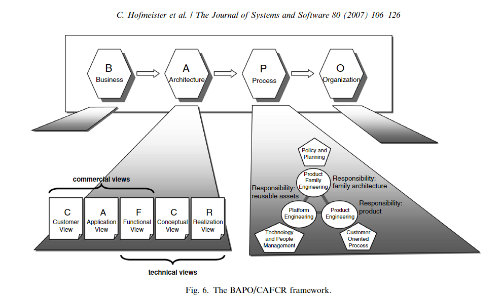

# BAPO/CAFCR
- Developed by Philips Research, BAPO/CAFCR aims to create a software architecture that aligns with business, process, and organizational contexts.
- BAPO stands for Business, Architecture, Process, and Organization, emphasizing the architecture's fit within these areas.

## CAFCR Views
- Customer: Focuses on customer needs, wishes, and objectives.
- Application: Bridges customer views to functional specifications.
- Functional: Describes the system's functionality and behavior.
- Conceptual: Outlines the high-level structure and principles.
- Realization: Details the technological implementation.

## Process
- Architects iteratively fill in information across CAFCR views, analyze quality attributes, and establish links between views and the broader business context.
- The approach uses storytelling to explore specific details and create reasoning links across views.
- Completeness is achieved when sufficient information for realization is documented, and quality attribute analysis shows no discrepancies.
- BAPO/CAFCR also addresses product family development within business processes, highlighting the importance of architectural alignment with broader business goals.
