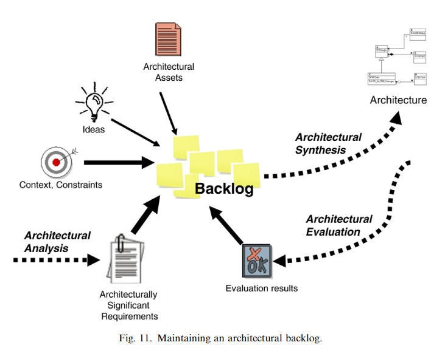

# Backlog
The concept of a backlog is a fundamental component in the workflow of architectural design, facilitating the management of tasks in an iterative development process. This concept is integral to various architectural methods, serving as a dynamic tool for guiding architects through the complexities of design.

## The Nature of Architectural Workflow
- Iterative Process: Architectural activities (analysis, synthesis, evaluation) do not follow a linear sequence but are executed iteratively, allowing the architecture to evolve over time.
- Complexity Management: Due to the overwhelming range of interrelated architectural concerns and the evolving understanding of project goals and constraints, the design process adopts small, incremental steps.
- Backlog Utilization: A backlog of needs, issues, and ideas is maintained to organize and prioritize tasks, driving the workflow and helping architects decide on the next steps.

## Characteristics of the Backlog
- Definition: A collection of smaller tasks including unresolved issues, ideas for consideration, and architectural concerns/ASRs identified for action.
- Form: Can vary from simple lists in an architect's notebook to electronic, shared documents for larger projects.
- Sources: Fed by architectural concerns/ASRs, feedback from evaluation phases, and insights from the architect's experiences or discussions.
- Content Examples:
  - Decision needs: "We need to decide X."
  - Investigative tasks: "We should look at Y to address Z."

## Prioritization and Management
- Prioritization: Items in the backlog are constantly reordered based on urgency, influenced by external factors such as risk mitigation, project milestones, and stakeholder pressures.
- Iteration Objectives: The prioritized items set the goals for each iteration, particularly driving the architectural synthesis by dictating the design decisions to be integrated next.
- Dynamic Updates: The backlog is continually updated—items are added, reprioritized, resolved, or returned for further consideration.

## Integration with Architectural Activities
- Synthesis Focus: While primarily guiding the synthesis activity, the backlog also occasionally drives analysis and evaluation activities.
- Resolution and Removal: Once an item is adequately addressed, it is removed from the backlog, and architects move on to the next prioritized task.
- Agile Methodology Link: The backlog concept parallels Agile project management practices, especially within Scrum, highlighting its utility in supporting flexible and responsive design processes.

## Tooling for Backlog Management
Variety of Tools: From informal lists and shared spreadsheets to more sophisticated wiki-based tracking tools like Trac, the choice of tool depends on project scale and team preferences.

## Significance
The backlog serves as a critical organizational tool in architectural design, enabling architects to navigate the complexity of design tasks through an iterative, prioritized approach. It exemplifies the agile principles within the context of architectural methods, ensuring a focused and efficient progression towards a coherent architectural solution.
