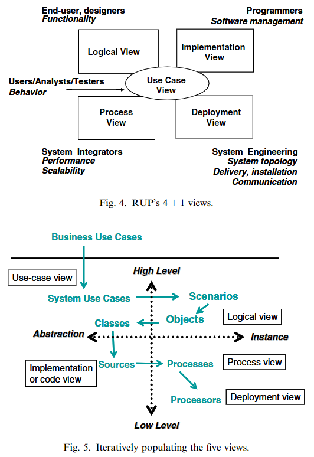

# Rational Unified Process RUP (4+1)
- Developed by Rational Software (now IBM), the Rational Unified Process (RUP) is a framework for software development.
- Architecture in RUP includes decisions on structure, behavior, subsystem composition, and architectural style, alongside considerations for usage, functionality, performance, and more.

## 4 + 1 Views:
1. Logical View: Focuses on the system's functionality and its division into modules.
2. Process View: Describes the system's dynamic aspects and how processes interact.
3. Implementation View: Deals with the system's software organization and layers.
4. Deployment View: Outlines the physical distribution of components.
5. Use-Case View (+1): Connects the design to user goals and context.

## Design Process:
- The architecture is developed iteratively during the **elaboration phase**, focusing on architecturally significant use cases and non-functional requirements.
- Each iteration produces an executable prototype for validation.

## Key Activities:
1. Define a Candidate Architecture: Start with use-case analysis and reference architecture to propose an initial design.
2. Perform Architectural Synthesis: Build and assess a proof-of-concept for functionality and non-functional requirements.
3. Refine the Architecture: Integrate design elements and mechanisms (e.g. [[Architectural Pattern]]), and review the architecture. 

The documentation covers all five views, with recent additions of perspectives to capture quality properties effectively.
