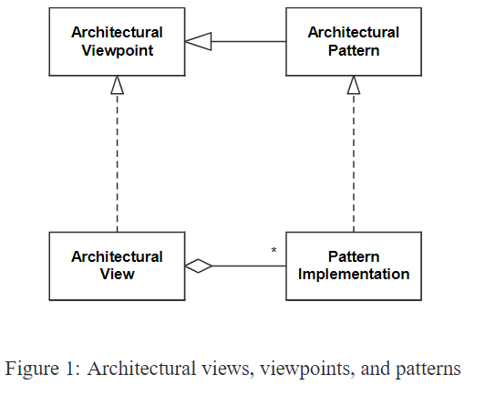

# Architectural View
Definition: A visual or textual representation of a particular aspect of a software system's architecture. It highlights a specific set of elements and their connections.

Another definition: Represents a system from a perspective of related concerns, detailing elements and their relationships. It's an instance of a [[Viewpoint]] that outlines types of elements, relationships, and meta-information for clear documentation and communication.

Purpose: Aids in understanding, communication, and analysis of the architecture from different stakeholder perspectives.

Example: A module view would visually depict the module structure along with their relationships, possibly using a diagrammatic notation.

## Relation to [[Structure]]
See [[Structure]]

## Architectural Views And [[Architectural Pattern]]s

### Major Approaches
- Large Granularity Views: Support multiple architectural patterns within a coarse-grained structure (e.g., structural or behavioral views).
- One-to-One Mapping: Each architectural pattern corresponds directly to a view, resulting in more specialized, fine-grained views.

### Middle Path
What the article follows

- Fine-grained vs. Coarse-grained: The classification seeks a balance, preferring views that are specific yet can accommodate more than one architectural pattern. This approach aims to highlight specific aspects like data flow or component interaction without limiting to individual patterns.

## View, [[Viewpoint]] And [[Architectural Pattern]]s
oin-patterns.png)
