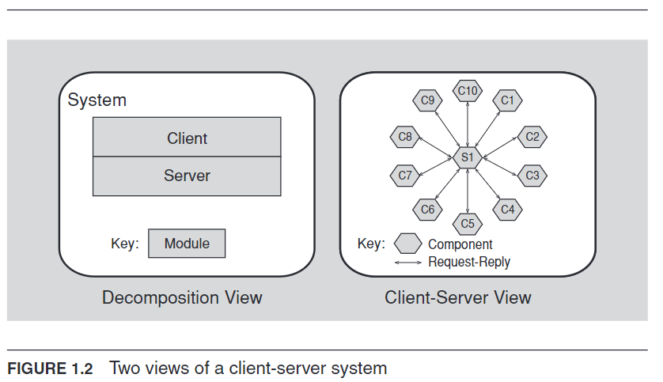

# Structures
In essence, architectural structures empower software architects with valuable insights and control over system design, making them crucial for achieving software quality goals

Definition: The actual components and their relationships within a software system (exists in the code or physical hardware).

Example: A module structure would define the various modules of a system and how they interact with each other.

## Relation to [[Architectural View]]
Views represent structures. Architects design the underlying structures but create specific views to tailor communication and understanding

## Three Kinds Of Structures
As seen in [[Architectural Structure]]s

The three broad decisions of architects

### [[Module Decomposition Structure]]
- Focus on system organization into code and data units.
- Reveal functional responsibilities, dependencies, and inheritance relationships.
- Key for analyzing a system's modifiability.

Can answer questions like
- What is the primary functional responsibility assigned to each module?  
- What other software elements is a module allowed to use?  
- What other software does it use and depend on?
- What modules are related to other modules by generalization or specialization (i.e., inheritance) relationships?

### [[Component-And-Connector Structure (C&C)]]
- Capture runtime behavior – components (units of computation) and connectors (communication).
- Explain runtime interactions, data flow, parallelism, and potential system structure changes.
- Critical for understanding performance, security, and availability

Can answer questions like
- What are the major executing components and how do they interact at runtime?
- What are the major shared data stores?
- Which parts of the system are replicated?
- How does data progress through the system?
- What parts of the system can run in parallel?
- Can the system’s structure change as it executes and, if so, how?

### [[Allocation Structure]]
- Show the relationship between software elements and external environments (CPUs, networks, file systems, teams).
- Help map processes to hardware, files to storage, and software to development teams

Can answer questions like
- What processor does each software element execute on?
- In what directories or files is each element stored during development, testing, and system building?
- What is the assignment of each software element to development teams?

### Relating Structures To Each Other
Multiple Structures, Multiple Perspectives:  Different structural views (e.g., [[Module Decomposition Structure]], [[Component-And-Connector Structure (C&C)]]) reveal various aspects of a software system's design. Each has its value.

Interconnectedness: Elements in various structures relate to each other. For example, a module in a decomposition structure might map to single or multiple components in a component-and-connector view.

Structure Dominance: Sometimes one structure is primary. Module decomposition is common because it aligns with the development team organization. Others, like component-and-connector, prioritize specific system qualities

## Fewer Is Better
Only write an architecture if it has a positive return on investment (e.g. lowers development time). With a single process the process structure is a single node and therefore, not worth documenting

## Structure Provides Insight
- Analytical Power: Each structure offers a unique perspective for analyzing quality attributes of the system, like Module structure: 
    - Ease of extensibility/contractability.
    - Concurrency structure: Potential for deadlocks and performance bottlenecks.
    - Deployment structure: Achievement of performance, availability, and security goals.
- Engineering Leverage: By designing structures appropriately, architects can achieve desired quality attributes.

## [[Six-Part Scenario]]s And Structural Connections
- [[Six-Part Scenario]]s help explore a structure's behavior and its connections to other structures.
- Example: Modifying the concurrency structure might require considering concurrency and deployment views, as they're related to processes, threads, and physical distribution mechanisms
