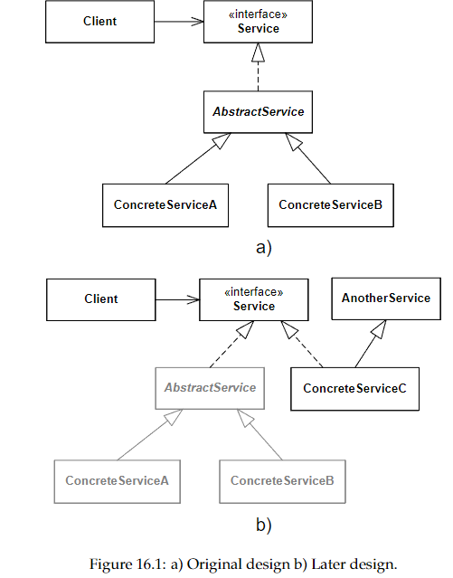
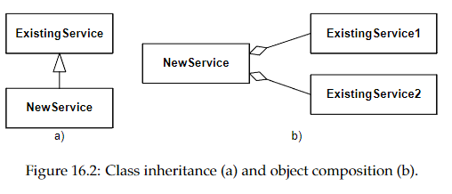

# Principles For Flexible Design
1. Program to an interface, not an implementation
2. Favor object composition over class inheritance
3. Consider what should be variable in your design (pr: Encapsulate the behavior that varies)

## 1. Program to an interface, not an implementation
- Abstraction: Focus on relevant aspects while ignoring unnecessary details. Essential for managing limited human memory capacity.
- Encapsulation: Object-oriented programming uses classes to hide complex details, exposing only necessary public methods. This simplifies understanding and interaction.

### Abstraction in Object-Oriented Languages:
Classes: Serve as the foundation, encapsulating implementation details (data structures, algorithms) and providing a clean interface through public methods.

### Programming Mindset:
Contract-Based Programming: Establishes a formal agreement between the functionality user (client) and provider (service). This contract ensures clients use methods correctly, and services deliver promised behavior.

### Clients are free to any service provider class
High Coupling: When clients are tied to concrete or abstract classes, they can only interact with objects from a specific class hierarchy. This limits flexibility and adaptability.

Decoupling via Interfaces: Interfaces enable clients to interact with different service providers without being limited to a specific class hierarchy. This promotes lower coupling and greater flexibility in software design.

### Interfaces allow more fine-grained behavioral abstractions
- Behavioral Abstractions: Unlike classes, which must encapsulate all aspects of a concept, interfaces focus solely on behavior. This allows for more precise and fine-grained abstractions.
- Decoupling from Concepts: Interfaces are decoupled from the concrete implementations, emphasizing specific behaviors rather than the entire concept.

### Interfaces better express roles
Emphasis on Roles: Interfaces are particularly effective in expressing the roles that objects play within a system. This perspective encourages the design of focused and smaller interfaces, enhancing clarity and modularity.

### Classes define implementation as well as interfaces
- Direct Access to Public Variables: An evident form of high coupling is when client classes access public instance variables of service classes directly, rather than through accessor methods. This practice tightly binds the client to the service's internal structure.
- Assumptions Based on Implementation Details: More subtly, clients may become dependent on undocumented behaviors or workarounds for defects in the service class. Such dependencies make it difficult to replace the service class with a different implementation without affecting the client class's behavior.

## 2. Favor object composition over class inheritance

### Class inheritance 
A subclass can reuse the implementation of the superclass to change or add behavior

#### Benefits
- Straightforward
- Supported in the programming language
- Write a little extra code to reuse functionality

#### Drawbacks
- Encapsulation Breach: Inheritance exposes superclass implementation to subclasses, leading to high coupling.
- Maintenance Cost: Changes in the superclass require extensive review and potential refactoring of all subclasses.
- Inherited Excess: Subclassing imports all superclass methods and data, including those conflicting with the subclass's intended use.
- Responsibility Limitation: Subclasses cannot remove inherited behaviors; they can only add new ones or override existing ones to disable them (e.g., through UnsupportedOperationException).
- Establishes compile-time coupling, fixing object behavior after instantiation.
- Adding new subclasses often leads to modifications in the class hierarchy. Introducing a common abstract class may seem logical but necessitates reviewing and testing multiple classes, impacting stability.

### Object composition
Complex behavior can be achieved by composing the behavior of a set of objects

#### Benefits
- Encourages low coupling through interface-based interactions, preserving encapsulation and simplifying modifications.
- Fine-grained Abstractions: Allows building focused abstractions, each dedicated to a specific task, enhancing cohesion and clarity in responsibility division.
- Allows dynamic behavior change via delegate objects, enabling run-time flexibility.
- Offers clear separation between implementations, like array list and tree map, without structural overlap.
- Objects with single, clear responsibilities can be tested in isolation, enhancing reliability. Dependencies can be managed with test stubs
- Smaller abstractions with fewer dependencies are easier to reuse, fitting various contexts without carrying unsuitable behavior.

#### Drawbacks
- While reducing overlap, the composition might lead to code duplication or necessitate further decomposition for efficiency.
- More objects, classes, and interfaces can complicate both runtime behavior and compile-time oversight. Maintaining an overview is crucial to prevent defects.
- Composition requires more boilerplate code. Unlike inheritance, where extending a class automatically grants access to its methods, composition necessitates explicit delegation, increasing the amount of code to manage.

## 3. Consider what should be variable in your design
- Core Idea: Focus on aspects of the design you wish to vary. Design software to accommodate these changes without altering the overall design structure.
- Reformulation: "Encapsulate what varies" - isolate variable elements within the design by utilizing interfaces. This encapsulation allows for variability without necessitating design changes.
- Application in Design Patterns: A common theme across many design patterns is the identification and encapsulation of variable aspects (e.g., business rules/algorithms in the [[Strategy pattern]]). Design patterns provide a framework that supports variation through object configuration rather than through design modification.
- Importance: This principle underscores the importance of flexibility in software architecture. By focusing on what may change and designing for those changes upfront, the software can adapt to new requirements without costly redesigns.
