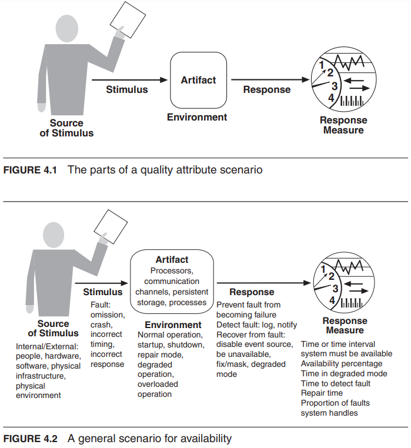

# Scenario
1. Source of stimulus. This is some entity (a human, a computer system, or any other actuator) that generated the stimulus.
2. Stimulus. The stimulus is a condition that requires a response when it arrives at a system.
3. Environment. The stimulus occurs under certain conditions. The system may be in an overload condition normal operation, or some other relevant state. For many systems, “normal” operation can refer to one of several modes. For these kinds of systems, the environment should specify in which mode the system is executing.
4. Artifact. Some artifact is stimulated. This may be a collection of systems, the whole system, or some piece or pieces of it.
5. Response. The response is the activity undertaken as the result of the arrival of the stimulus. 
6. Response measure. When the response occurs, it should be measurable in some fashion so that the requirement can be tested

### General Quality Attribute Scenarios
    Definition: System-independent scenarios that can apply to any system.

Purpose: Serve as a universal set of scenarios to characterize quality attributes broadly.
Application: These scenarios provide a foundational understanding of quality attributes without being tied to a specific system.

### Concrete Quality Attribute Scenarios:
    Definition: Scenarios specific to a particular system under consideration.

Transformation: General scenarios are tailored to become concrete scenarios to address specific system requirements.
Purpose: Ensure that the generic attributes are translated into actionable, system-specific requirements.

