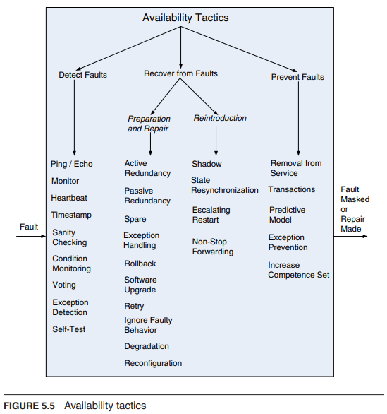

# Availability Tactics
The objective of Availability Tactics: To maintain the system's service delivery in compliance with its specifications despite the presence of system faults. This involves preventing faults from leading to failures or limiting the impact of faults to facilitate repair.

## Categories of Availability Tactics
- Fault Detection: Identifying faults within the system.
- Fault Recovery: Responding to and rectifying faults to return to a state of normal operation.
- Fault Prevention: Implementing measures to avoid the occurrence of faults.

Role of the Architect: Architects primarily assess and select appropriate availability tactics, often provided by software infrastructures like middleware, rather than implementing these tactics directly. This selection process involves choosing and combining tactics effectively to ensure system availability.

## Tactics
To read more about a specific tactic, please see pages 87-95 in [[Software Architecture in Practice - Book.pdf]]

