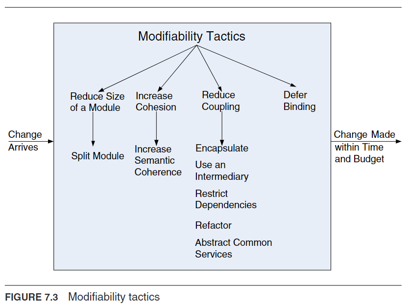

# Modifiability Tactics
Goal: To manage the complexity, time, and cost of making changes to a system.
Focus: On coupling and cohesion as fundamental concepts to understand modifiability.

## Key Concepts
- Coupling: Measures the likelihood that a change in one module will necessitate changes in another. High coupling is detrimental to modifiability.
- Cohesion: Indicates how closely related the responsibilities within a module are, representing the module's unity of purpose. High cohesion is favorable for modifiability.

## Parameters Influencing Modifiability Tactics
- Size of a Module: Smaller modules can be more easily modified, especially when modifications align with the module's specific responsibilities.
- Coupling: Lowering the coupling between modules reduces the cost and complexity of modifications.
- Cohesion: Enhancing a module's cohesion by consolidating related responsibilities improves modifiability.
- Binding Time of Modification: Architectures that accommodate late-stage modifications more efficiently reduce overall costs and complexity.

## Tactics for Enhancing Modifiability
- Reducing Module Size: Dividing modules based on likely changes to minimize modification scope.
- Reducing Coupling: Introducing intermediaries between modules to decrease dependency.
- Increasing Cohesion: Refining module responsibilities to focus on related functions.
- Deferring Binding Time: Preparing the architecture to support late-cycle changes effectively.

## Considerations for Software Development Life Cycle
The timing of changes is crucial; late-life-cycle modifications are preferable if the architecture supports them, balancing the preparation cost against the benefits of reduced modification costs.

## Tactics
To read more about a specific tactic, please see pages 123-125 in [[Software Architecture in Practice - Book.pdf]]

