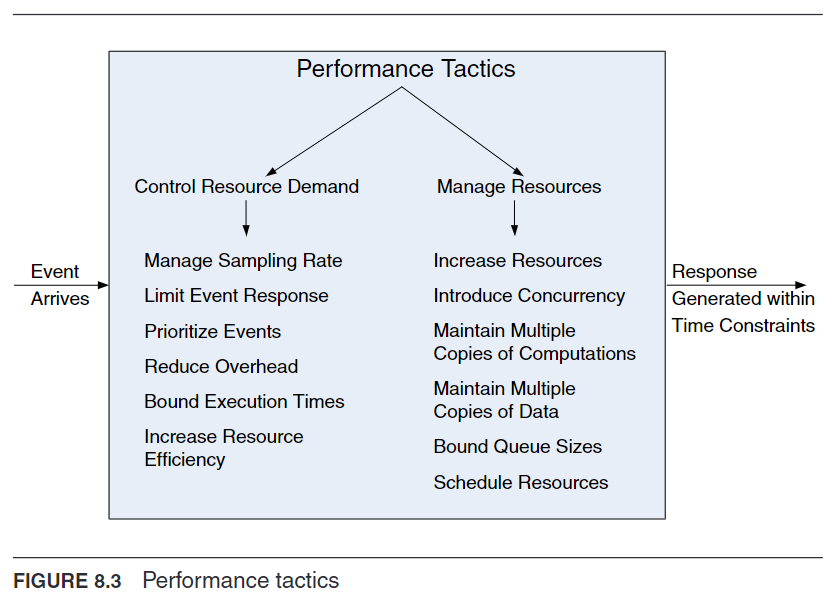

# Performance Tactics
Aim: To ensure system responses to events meet specific time constraints.
Events can be singular or continuous streams triggering computations.

## Key Factors Influencing Response Time
1. Processing Time: Time consumed by the system to actively respond to an event. Involves resource utilization such as CPU, memory, network bandwidth, and software entities (e.g., buffers, critical sections). Each step in processing an event—from receiving, buffering, transforming, to sending—consumes time and resources.
2. Blocked Time: Time during which the system is unable to respond due to:
   - Contention for Resources: When multiple requests compete for the same resource, causing delays.
   - Resource Unavailability: When a needed resource is offline or fails, preventing progress.
   - Dependency on Other Computations: When a computation awaits the results of another, especially significant over networks.

## Strategies for Improving Performance
Control Resource Demand: Reducing the demand on resources to lessen the load and prevent resource saturation. This approach aims to minimize the required resources to service events, effectively decreasing potential bottlenecks.

Manage Resources: Enhancing how resources are utilized to better meet demand. This includes optimizing resource allocation and usage to handle demands efficiently.

## Tactic Categories
Reducing Demand for Resources: Implements measures to lower the system's resource consumption, addressing the demand side of performance issues.

Managing Resource Supply: Focuses on optimizing the use of available resources to ensure they meet the demand more effectively, addressing the supply side.

## Tactics
To read more about a specific tactic, please see pages 137-142 in [[Software Architecture in Practice - Book.pdf]]

