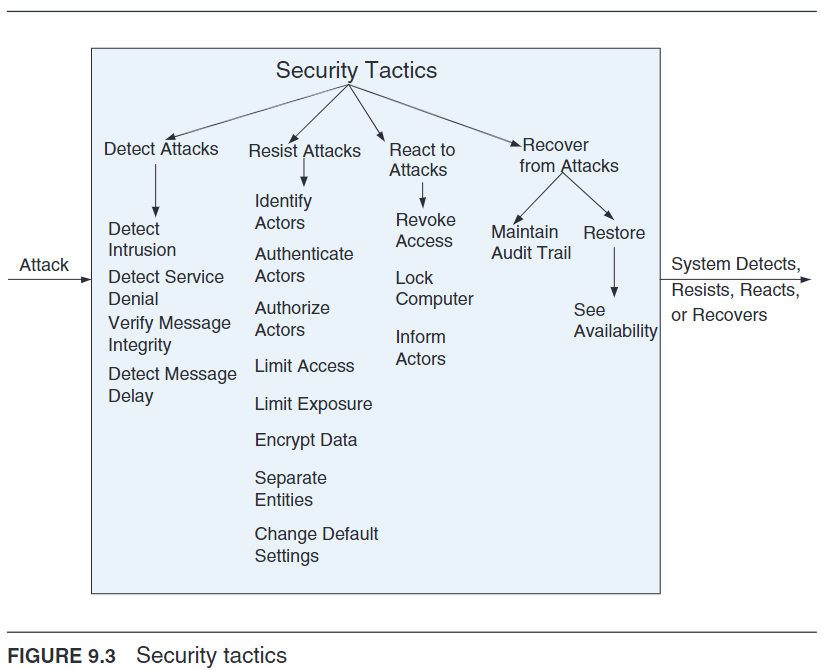

# Security Tactics
Drawing parallels to physical security, system security can be enhanced by adopting similar principles, including controlled access, intrusion detection, deterrence, reactive measures, and recovery strategies.

## Four Categories of Security Tactics
- Detect: Implementing mechanisms to identify unauthorized access or activities. This involves monitoring system activities to promptly identify potential security breaches, similar to using badges and surveillance in physical security.
- Resist: Establishing barriers or safeguards to prevent unauthorized access or modifications. This is akin to employing security checkpoints and deterrent measures like armed guards in a physical setup, aiming to prevent intrusions before they occur.
- React: Taking immediate action upon detecting a security breach. Reactive measures could include automatic responses such as locking down systems or alerting administrators, mirroring the concept of automatic door locks in response to unauthorized access in physical security.
- Recover: Develop strategies to restore system functionality and secure data after a breach. This involves implementing recovery mechanisms like off-site backups, ensuring that the system can be quickly restored to operational status following a security incident.

## Tactics
To read more about a specific tactic, please see pages 151-154 in [[Software Architecture in Practice - Book.pdf]]

