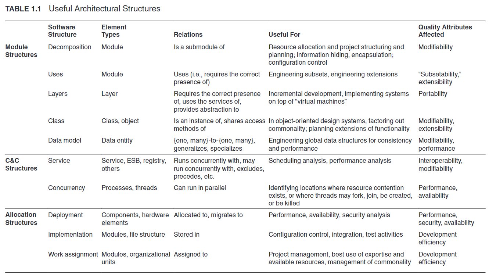

# Software Architecture in Practice
See [[Software Architecture in Practice - Book.pdf]]

## 1 What Is Software Architecture

### 1.1 What Software Architecture Is and What It Isn't
- [[Software Architecture]] (not all software are architectures)
- [[Architectural Structure]]
- [[Software Architecture]]

Related disciplines, have broader concerns than software but needs and software architects present
- [[System Architecture]]
- [[Enterprise Architecture]]

### 1.2 Architectural Structures And Views
- [[Structure]]
- [[Architectural View]]
- [[Module Decomposition Structure]]
- [[Component-And-Connector Structure (C&C)]]
- [[Allocation Structure]]

### 1.2 [[Architectural Pattern]]s
- [[Architectural Pattern]]
  - [[Layered Pattern]]
  - [[Shared-Data (Or Repository) Pattern]]
  - [[Client-Server Pattern]]
  - [[Multi-Tier Pattern]]
  - [[Competence Center And Platform Pattern]]

### 1.3 [[Architectural Pattern]]s
- [[Architectural Pattern]]

### 1.4 What Makes A "Good" Architecture
- [[Software Architecture]]

## 4 Understanding Quality Attributes
- [[Quality Attribute QA]]
- [[Requirement]]

### 4.1 Architecture And Requirements
- [[Requirement]]

### 4.2 Functionality
- [[Functionality]]

### 4.3 Quality Attributes Considerations
- [[Quality Attribute QA]]

### 4.4 Specifying Quality Attribute Requirements
- [[Quality Attribute QA]]
- [[Six-Part Scenario]]

### 4.5 Achieving Quality Attributes Through Tactics
- [[Architectural Tactic]]

## 5

### 5.2 Tactics For Availability
- [[Availability Tactics]]

## 7

### 7.2 Tactics For Modifiability
- [[Modifiability Tactics]]

## 8

### 8.2 Tactics For Performance
- [[Performance Tactics]]

## 9

### 9.2 Tactics For Security
- [[Security Tactics]]

## 21 - Architecture Evaluation

### Keywords
- [[Architecture Evaluation]]
- [[Contextual Factors]]
- [[Architectural Tradeoff Analysis Method (ATAM)]]
  - [[Quality Attribute Utility Tree]]
- [[Lightweught ATAM]]
